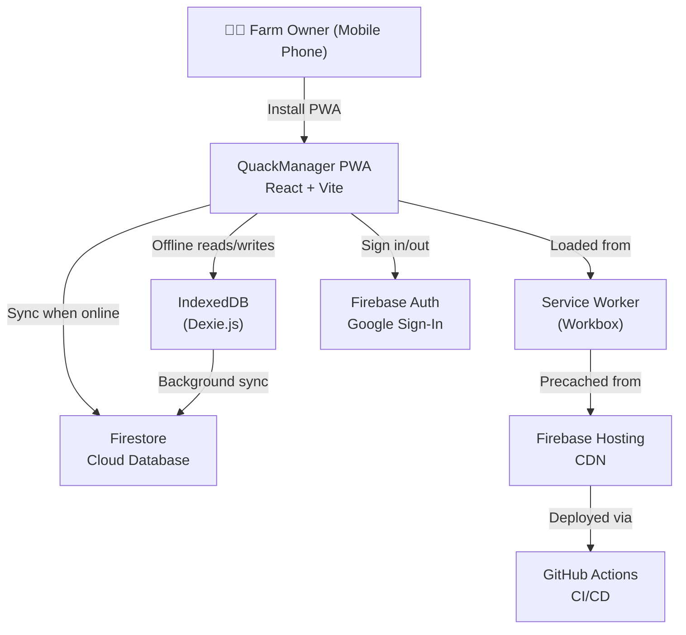
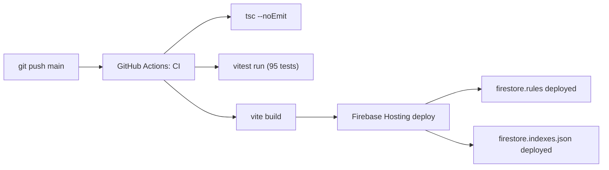

# Architecture Overview

**Audience**: Senior engineers and technical leaders evaluating the system design.

**Last updated**: 2026-06-02

---

## System Context

QuackManager is a **single-page application (SPA)** delivered as a **Progressive Web App (PWA)** to mobile devices. It has no backend server — all cloud services are provided by Firebase.



---

## Architecture Style: Offline-First Modular Monolith

The app follows a **modular monolith** pattern — a single deployable unit (Vite build output) with feature-based internal modules. The defining architectural characteristic is **offline-first**: all data operations go through a local IndexedDB database, with cloud synchronization happening asynchronously.

### Why Not a Service Worker-Based Sync?

A common alternative is to handle sync entirely in the service worker using Workbox background sync. We opted for an **in-app sync engine** instead because:

- **Better error handling**: The React layer can show sync status, retry logic, and user-facing error messages
- **Conflict resolution**: The app controls the last-write-wins logic explicitly
- **Testability**: The sync engine is unit-testable with Vitest, while SW-based sync is harder to test
- **Simplicity**: No need to coordinate between SW and app contexts for data access

### Why Not a Backend Server?

Firebase provides auth, database, and hosting on a single free tier that handles the projected 50–200 daily transactions of a 100–500 duck farm. No REST/GraphQL API is needed because the Firebase SDK communicates directly with Firestore.

---

## Data Flow

### Write Path

```
User taps "Save" → React component → Zustand (UI state) → Dexie.js (IndexedDB)
                                                              │
                                              ┌───────────────┴───────────────┐
                                              │  syncedAt = undefined (queued) │
                                              └───────────────┬───────────────┘
                                                              │
                                              [Sync Engine runs]
                                                              │
                                                              ▼
                                              ┌───────────────────────────────┐
                                              │  Firestore (batch write)      │
                                              │  syncedAt = timestamp (done)  │
                                              └───────────────────────────────┘
```

### Read Path

```
User opens Dashboard → React component → useEggCollection() hook
                                              │
                                              ▼
                                  Dexie liveQuery (IndexedDB)
                                              │
                                              ▼
                              Instant result (no network needed)
```

### Sync Trigger Points

| Trigger | When | Direction |
|---------|------|-----------|
| App load | 1 second after mount | Push + Pull |
| Connectivity change | Coming back online | Push |
| Periodic | Every 5 minutes while active | Push |
| Manual | `useSyncStore.getState().sync()` | Push |

---

## Component Architecture

### UI Layer

```
main.tsx
  └── HashRouter
       └── App
            ├── /login → LoginPage
            └── / → AppShell (ProtectedRoute)
                 ├── Header (SyncIndicator)
                 ├── <Outlet /> (page content)
                 │    ├── / → DashboardPage
                 │    ├── /production → ProductionPage
                 │    │    └── EggCollectionForm
                 │    ├── /sales → SalesPage
                 │    ├── /expenses → ExpensesPage
                 │    └── /reports → ReportsPage
                 └── Bottom Tab Bar (5 tabs)
```

### State Layer

| Store | Type | Persistence | Contents |
|-------|------|-------------|----------|
| `authStore` | Zustand | localStorage (persist middleware) | `user`, `isAuthenticated`, `isLoading` |
| `appStore` | Zustand | In-memory | `todayDate`, `syncStatus`, `activeTab` |
| `alertStore` | Zustand | In-memory | `alerts[]` (warnings, reminders) |
| `syncStore` | Zustand | In-memory | `isOnline`, `pendingCount`, `lastSynced` |
| Dexie tables | IndexedDB | Browser storage | All farm data entities |

### Data Layer

```
Dexie Database (QuackManagerDB)
├── eggCollections    ← EggCollection records
├── eggSales          ← Egg sale records
├── feedPurchases     ← Feed purchase records
└── expenses          ← Expense records
```

---

## Sync Engine Design

The sync engine (`src/sync/syncEngine.ts`) runs as a singleton, initialized when the authenticated app shell mounts.

```typescript
// Core sync function
async function runSync(direction: 'push' | 'pull' | 'both'): SyncResult

// Initialization
function initSyncEngine(): () => void  // returns cleanup function
```

### Push Flow

1. Query all Dexie tables for entries where `syncedAt === undefined`
2. Batch-write unsynced entries to Firestore
3. Mark entries as synced in Dexie (`syncedAt = new timestamp`)
4. Update `syncStore.pendingCount` (remaining unsynced items)

### Pull Flow

1. Query Firestore collections (max 500 docs per collection)
2. For each remote document: if the local copy has `syncedAt` set (i.e., not dirty), overwrite it
3. This implements **last-write-wins**: local unsynced changes are preserved

### Error Handling

- Individual collection failures don't block other collections
- Partial syncs update `lastSynced` timestamp so the user sees progress
- Errors are collected into `SyncResult.errors[]` for logging

---

## Security Architecture

### Layers

| Layer | Mechanism |
|-------|-----------|
| **Authentication** | Firebase Google Sign-In (`signInWithPopup`) |
| **Session persistence** | Zustand persist middleware → localStorage |
| **API authorization** | Firestore Security Rules (auth-required, field validation) |
| **Network security** | HTTPS enforced by Firebase Hosting + CSP headers |
| **Local data** | Device-level encryption (phone lock screen) |

### Firestore Security Rules Pattern

```firestore
match /eggCollections/{docId} {
  allow read: if request.auth != null;
  allow create: if request.auth != null
                && request.resource.data.keys().hasAll(['date', 'quantity', 'createdAt'])
                && request.resource.data.quantity is number
                && request.resource.data.quantity >= 0
                && request.resource.data.quantity <= 9999;
}
```

All collections follow this pattern: **auth-required reads**, **validated writes** with type checks and range constraints.

---

## Build and Deployment Pipeline



### Bundle Composition (Production)

| Chunk | Size (gzipped) | Contents |
|-------|---------------|----------|
| `vendor-*.js` | 53 KB | React, React DOM, React Router |
| `firebase-*.js` | 65 KB | Firebase App, Auth, Firestore |
| `dexie-*.js` | 32 KB | Dexie.js (IndexedDB wrapper) |
| `index-*.js` | 9 KB | Application code |
| `index-*.css` | 3.5 KB | Tailwind CSS (purged) |

---

## Testing Strategy

| Layer | Tool | Count | Scope |
|-------|------|-------|-------|
| **Unit tests** | Vitest | 43 | Calculations, recurring expense logic |
| **Store tests** | Vitest | 21 | Auth, alerts, sync, app state |
| **Component tests** | React Testing Library | 31 | EggCollectionForm, SyncIndicator, Dashboard |
| **E2E tests** | Playwright | 29 | Navigation, egg collection, offline, PWA |

### E2E Test Approach

Playwright tests bypass Google Sign-In by injecting auth state into `localStorage` via `page.addInitScript`. This allows the full 29-test suite to run without external dependencies.

---

## Cost Analysis (Monthly)

| Service | Free Tier Usage | Projected | Cost |
|---------|----------------|-----------|------|
| Firebase Hosting | 10 GB storage, 360 MB/day bandwidth | << 1% | **$0** |
| Firestore | 1 GB stored, 50K reads/day, 20K writes/day | << 10% | **$0** |
| Firebase Auth | 50K MAU | 1 user | **$0** |
| GitHub Actions | 2,000 min/month | ~50 min | **$0** |
| **Total** | | | **$0** |

---

## Key ADRs

| ADR | Decision | Rationale |
|-----|----------|-----------|
| ADR-001 | React + Vite over Next.js | No SSR needed for internal PWA |
| ADR-002 | Zustand + Dexie.js dual-state | Clear separation of UI vs data state |
| ADR-003 | Firebase serverless | Free tier sufficient for farm scale |
| ADR-004 | Last-write-wins conflict resolution | Simple enough for single-user app |

See [ADR-001-to-004](../architecture/ADR-001-to-004.md) for full context.

---

## Future Considerations

### Multi-Farm Support
If the app needs to support multiple farms, add a `farmId` field to all documents and adjust Firestore Security Rules. This is a data-model change, not an architectural one.

### Receipt Photo Uploads
When photo attachments are needed, add Firebase Storage integration. The `Expense` model already has a `receiptPhotoUrl` field ready.

### Shared Device Concerns
If the app is used on shared phones, add IndexedDB encryption via the Web Crypto API. Currently relies on device-level lock screen security.

### Performance at Scale
At 500+ daily transactions, consider adding Firestore composite indexes for common queries. The current single-user workload doesn't require them, but the `firestore.indexes.json` file is ready for deployment.
